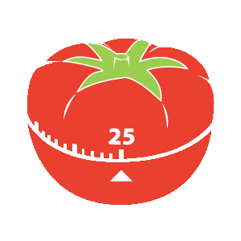
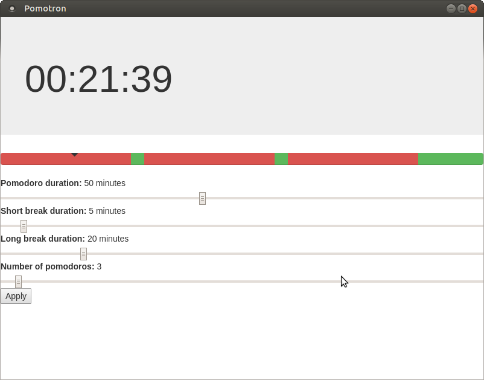

# Pomotron
Pomotron is a timer for using the [Pomodor Technique](https://en.wikipedia.org/wiki/Pomodoro_Technique) on Windows, Mac OS X and Linux.
It is implemented using [Electron](http://electron.atom.io/).

## Running Pomotron

### Install dependencies

Execute `npm install`.

### Run the code

Execute `npm start`.

## Features

- Customize `working`/`short break`/`long break` durations.
- Visualize the time distribution easily.
- Know at any moment where are you in the current pomodoro.
- Fullscreen notification at the of the pomodoro so you won't miss any break again.
- Autostart when usre logs in.

## Why Pomotron?

I recently upgraded my operating system. I am currently using Ubuntu Mate 16.04 64-bits. Before I was using an excellent pomodoro timer [gnome-pomodoro](http://gnomepomodoro.org/) but it was no longer compatible with my desktop. I looked for many options freely available online and none of them convinced me, so I implemented one cross-platform solution.

#### License [Apache 2.0](LICENSE).
